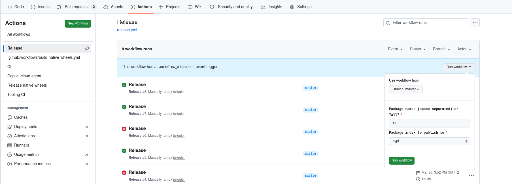

# Justfile Recipe Reference

This document is organised in two parts:

- **[User guides](#user-guides)** — step-by-step walkthroughs for common tasks such as day-to-day development, releasing projects, and running the full test matrix.
- **[Recipe overview](#recipe-overview)** — a detailed reference for every individual `just` recipe: what it does, all arguments, and usage examples.

Run `just --list` at any time for a quick one-line summary of all available recipes.

---

## Table of contents

- [User guides](#user-guides)
  - [Day-to-day development](#day-to-day-development)
  - [Releasing](#releasing)
    - [Releasing via the workflow (recommended)](#releasing-via-the-workflow-recommended)
    - [Releasing a pure-Python project locally](#releasing-a-pure-python-project-locally)
    - [Releasing a batch of projects locally](#releasing-a-batch-of-projects-locally)
    - [Releasing a native (Rust) project](#releasing-a-native-rust-project)
  - [Testing across all Python versions](#testing-across-all-python-versions)
- [Configuration variables](#configuration-variables)
- [Recipe overview](#recipe-overview)
  - [Testing](#testing)
  - [Building native extensions](#building-native-extensions)
  - [Releasing](#releasing-1)
  - [Code quality](#code-quality)
  - [Tooling](#tooling)
  - [Maintenance](#maintenance)
    - [`just sync`](#just-sync-env)
    - [`just clean`](#just-clean)
    - [`just docs-check`](#just-docs-check)
    - [`just docs-clean`](#just-docs-clean)

---

## User guides

### Day-to-day development

1. Make changes to one or more projects.
2. Run `just test <project> <env>` to check a single project quickly.
3. Run `just test-affected` before pushing to check all projects touched by your diff.
4. Run `just lint` to verify formatting and minimum-version compliance.

### Releasing

**Releases should be initiated through the GitHub Actions release workflow, not from a developer's machine.** The workflow is the recommended, default path for every release. The local `just release` recipe still exists, but it is intended only for testing (dry-runs against TestPyPI) and emergencies (e.g. CI is unavailable and a fix must ship).

Running releases through the workflow is strongly preferred for three reasons:

- **Security** — publishing credentials never leave GitHub. The workflow authenticates via an environment-scoped `UV_PUBLISH_TOKEN` secret (or OIDC Trusted Publishing), so no PyPI token needs to live on, or be exported from, a developer's machine.
- **Isolation** — each release runs on a clean, ephemeral CI runner from a known-good checkout of the default branch, eliminating "works on my machine" state such as stray local edits, uncommitted files, or a dirty virtual environment.
- **Auditing** — every release is a recorded workflow run with a timestamp, the triggering user, the exact inputs, and full logs. The `pypi_publish` environment can additionally require a manual approval gate, and a concurrency lock guarantees only one release runs at a time.

Before the first release, complete the one-time environment, token, and GitHub App setup described in [setup.md](setup.md). See [release-strategy.md](release-strategy.md) for the full design rationale, authentication modes, and required secrets.

#### Releasing via the workflow (recommended)

1. **Bump the version and commit** (see the local guides below for the `just bump` mechanics) so the default branch contains the version you intend to publish.
2. In GitHub, open **Actions → Release → Run workflow** and fill in the form:

   

   - **`packages`** — a space-separated list of project names, or `all` to release every project with a pending (untagged) version.
   - **`index`** — the target index: `pypi` (default) or `testpypi` for a dry run.
3. Click **Run workflow**. The run publishes each pending project and pushes a namespaced git tag (`dissect.util/<version>`) per successful publish.
4. For **native (Rust) projects**, no extra step is needed: the tag pushed in step 3 automatically triggers `release-native.yml`, which builds and publishes the platform-specific wheels.

#### Releasing a pure-Python project locally

> **For testing and emergencies only.** Prefer [Releasing via the workflow](#releasing-via-the-workflow-recommended). The local path requires a `UV_PUBLISH_TOKEN` on your machine and has no approval gate or audit trail.

1. **Bump the version** — only if the current version has already been released:
   ```
   just bump dissect.util
   ```
   Commit the `pyproject.toml` and `uv.lock` changes together with the work that motivates the bump.

2. **Tighten a downstream constraint** (only if a new minimum is required):
   ```
   just set-constraint dissect.util ">=3.25,<4"
   ```
   Commit the changes and updated `uv.lock`.

3. **Dry-run to TestPyPI** (optional but recommended for a first release or structural changes):
   ```
   just release dissect.util --index testpypi
   ```

4. **Release to PyPI**:
   ```
   just release dissect.util
   ```
   The script publishes the wheel and sdist, then creates and pushes a git tag `dissect.util-<version>`.

5. **Update the meta-project** (if releasing `dissect` itself, or after bulk releases):
   ```
   just update-meta
   just release dissect
   ```

#### Releasing a batch of projects locally

> **For testing and emergencies only.** Prefer [Releasing via the workflow](#releasing-via-the-workflow-recommended) with `packages: all`, which performs the same batch release under CI isolation and auditing.

1. **Auto-bump all projects with new commits** since their last release:
   ```
   just bump auto
   ```
   This bumps every project that has a release tag for its current version and new commits since that tag. Projects that were already manually bumped (and are therefore pending release) are silently skipped.

2. **Check what is pending**:
   ```
   just pending-releases
   ```

3. **Release all pending projects**:
   ```
   just release all
   ```

#### Releasing a native (Rust) project

Native projects cannot be released with `just release` because they require platform-specific wheels built by cibuildwheel. Instead:

1. Bump the version and commit as above.
2. Trigger the `release-native` GitHub Actions workflow manually (`workflow_dispatch`), specifying the project name. The workflow builds wheels for all platforms and architectures, runs `abi3audit`, and publishes to PyPI via OIDC Trusted Publishing.

To validate the wheel pipeline locally before triggering the workflow:
```
just test-native-wheels auto dissect.util
```

### Testing across all Python versions

```
just test-all-envs
```

This runs the full test suite for every Python version in `[tool.monorepo.test].python-versions`. Equivalent to what CI runs on push/PR.

---

## Configuration variables

The Justfile declares two module-level variables that are evaluated once when `just` starts.

### `tooling_python`

Read from `.monorepo/tooling-python`. A `uv`-compatible Python version range (e.g. `>=3.12,<3.14`) that selects the interpreter used to run the monorepo's own management scripts — `bump_version.py`, `python_versions.py`, `affected_tests.py`, etc. This version is chosen for what is needed to run the scripts themselves, and is independent of the Python versions the projects support.

Update `.monorepo/tooling-python` when the scripts require a newer Python feature.

### `default_python`

A plain version string (e.g. `3.10`) used as the default `env` argument for every recipe that runs tests, builds extensions, or syncs environments. It should match the first CPython entry in `[tool.monorepo.test].python-versions` in `pyproject.toml`.

If you change the minimum supported Python version in `pyproject.toml`, update `default_python` in the Justfile to match.

---

## Recipe overview

### Testing

#### `just test <project> <env> [args]`

Run pytest for a single project using the given Python version. All workspace members are installed as editable so sibling dependencies are importable. Optional extra pytest arguments can be passed as the third argument.

```
just test dissect.xfs 3.11
just test dissect.xfs 3.11 "-k test_foo"
```

#### `just test-all [env] [args]`

Run pytest for every project in `projects/` using the given Python version (default: `3.10`). Skips directories without a `pyproject.toml`.

```
just test-all 3.12
just test-all 3.10 "-k test_foo"
```

#### `just test-all-envs`

Run `test-all` for every Python version listed in `[tool.monorepo.test].python-versions` in `pyproject.toml`. Used by CI to cover the full version matrix.

#### `just test-affected [ref] [env]`

Run tests only for projects whose source files changed relative to `ref` (default: `origin/main`) using the given Python version (default: `3.10`). The list of affected projects is computed by `.monorepo/affected_tests.py`.

```
just test-affected origin/main 3.11
```

#### `just test-native <project> <env> [args]`

Build the Rust extension for a single native project in-place, then run its tests with `DISSECT_FORCE_NATIVE=1` so the test suite fails (rather than silently skipping) if the compiled extension cannot be imported.

```
just test-native dissect.util 3.12
just test-native dissect.util 3.12 "-k test_lz4"
```

#### `just test-native-all [env]`

Build all Rust extensions in-place, then run the full test suite with `DISSECT_FORCE_NATIVE=1`.

#### `just test-native-affected [ref] [env]`

Build all Rust extensions in-place, then run tests only for affected projects with `DISSECT_FORCE_NATIVE=1`. All extensions are always built (not only affected ones) so that non-affected native projects are available as compiled dependencies for the projects under test.

---

### Building native extensions

#### `just build-native-inplace <project> [env]`

Compile the Rust extension for a single native project in-place using `setuptools-rust`. The resulting `.so` lands directly under `src/`, where the uv editable install can find it. Requires `cargo`/`rustup` installed locally.

```
just build-native-inplace dissect.util 3.12
```

#### `just build-all-native-inplace [env]`

Compile all native extensions in-place. Iterates over the project list from `.monorepo/native_projects.py`.

#### `just build-native-wheels <pkg> [archs]`

Build production wheels (abi3 + free-threaded) for a single project via cibuildwheel. The `CIBW_BUILD` specifier is derived from `python-versions` in `pyproject.toml` via `.monorepo/python_versions.py`. After building, runs `abi3audit` on any abi3 wheels to verify stable-ABI compliance. Requires Docker (or Podman) for Linux builds.

`archs` defaults to `"auto"` (host architecture only). Pass a space-separated list to build for additional platforms — callers are responsible for configuring QEMU first.

```
just build-native-wheels dissect.util
just build-native-wheels dissect.util "x86_64 i686 aarch64"
```

Wheels land in `dist/<pkg>/`.

#### `just test-native-wheels [archs] [packages]`

Build wheels for all native projects (or a specified subset) and run their tests in the built wheels via cibuildwheel's built-in test step. Used by CI on every push/PR to validate the full wheel pipeline locally or in GitHub Actions.

```
just test-native-wheels                                         # host arch, all native projects
just test-native-wheels "x86_64 i686 aarch64"                  # multi-arch (caller configures QEMU)
just test-native-wheels auto "dissect.util dissect.fve"         # specific projects only
```

---

### Releasing

#### `just release <packages|all> [--index testpypi]`

> **Prefer the release workflow.** Releases should normally be initiated through GitHub Actions (**Actions → Release**) — see [Releasing via the workflow](#releasing-via-the-workflow-recommended). Run this recipe locally only for testing or emergencies.

Publish pending workspace projects to PyPI, then create and push git tags. Only pure-Python projects — native (Rust) projects are released via the `release-native.yml` GitHub Actions workflow.

Pass `all` to release every project that has a pending (untagged) version, or list project names explicitly. Pass `--index testpypi` to publish to TestPyPI for a dry run.

For authentication, set `UV_PUBLISH_TOKEN=<token>` locally. CI uses OIDC Trusted Publishing and needs no token.

```
just release all
just release dissect.util dissect.cstruct
just release all --index testpypi
```

#### `just bump <packages|auto>`

Bump the minor version of one or more workspace projects and regenerate `uv.lock`. Pass `auto` to bump only projects that have new commits since their last release tag.

**Guards**: when bumping named projects, refuses to bump any project whose current version has no release tag yet — release pending versions first to avoid double-bumps. Also refuses to bump any project that has no new commits since its last release tag — there is nothing to release. `auto` silently skips both pending projects and projects without new commits instead of erroring.

```
just bump dissect.util dissect.cstruct
just bump auto
```

#### `just bump-patch <packages>`

Bump the patch component of one or more workspace projects and regenerate `uv.lock`. Always produces a three-part version (e.g. `3.5` → `3.5.1`, `3.5.2` → `3.5.3`). `auto` is not supported — patch bumps always require explicit project names.

**Guards**: identical to `just bump` — refuses to bump any project whose current version has no release tag yet, and refuses to bump any project that has no new commits since its last release tag. A batch bump is aborted if any single target fails a guard.

```
just bump-patch dissect.util
just bump-patch dissect.util dissect.cstruct
```

#### `just pending-releases [--names]`

List workspace projects whose current version has no corresponding git release tag (i.e. not yet published). Pass `--names` to get a bare newline-separated list of project names, suitable for scripting.

#### `just set-constraint <package> <specifier>`

Update the version specifier for an internal dependency across every project that already declares it. Runs `uv lock` afterward to keep the lockfile consistent.

```
just set-constraint dissect.cstruct ">=4.7,<5"
```

#### `just update-meta`

Regenerate the dependency list of the `dissect` meta-project from current workspace versions. Run this before releasing `dissect` to ensure it points at the latest versions of all member projects.

---

### Code quality

#### `just lint`

Run `ruff check`, `ruff format --check`, and `vermin` over all projects. Reports problems without modifying any files.

#### `just fix`

Auto-fix ruff issues (check + format). `vermin` has no auto-fix mode.

#### `just ruff [fix]`

Run ruff check and format. Pass `fix="true"` to apply fixes; default is report-only.

#### `just vermin`

Run `vermin` to verify that no project uses Python features newer than the declared minimum version (`3.10`).

---

### Tooling

These recipes run and lint the monorepo management scripts themselves. They operate on the `.monorepo/` directory rather than on the projects under `projects/`.

#### `just test-tooling [flags]`

Run the full tooling test suite (unit and integration tests under `.monorepo/tests/`). `MONOREPO_FIXTURE` defaults to `.` (the current monorepo). Pass any extra pytest flags as positional arguments.

```
just test-tooling
just test-tooling -v
MONOREPO_FIXTURE=/tmp/dissect-monorepo-test just test-tooling -v
```

#### `just test-tooling-unit [flags]`

Run only the unit tests under `.monorepo/tests/unit/`.

```
just test-tooling-unit
just test-tooling-unit -x
```

#### `just test-tooling-integration [flags]`

Run only the integration tests under `.monorepo/tests/integration/`. Integration tests are slower — they build a throw-away copy of the monorepo and exercise the full `just bump` / `just release` workflows end-to-end. `MONOREPO_FIXTURE` defaults to `.`, which reuses the current working tree as the fixture to avoid a full build.

```
just test-tooling-integration -k "test_bump"
MONOREPO_FIXTURE=/tmp/dissect-monorepo-test just test-tooling-integration -v
```

#### `just lint-tooling [fix]`

Run `ruff check` and `ruff format --check` over the `.monorepo/` directory. Pass `fix="true"` to apply auto-fixes instead of only reporting.

```
just lint-tooling
just lint-tooling fix="true"
```

---

### Maintenance

#### `just sync [env]`

Create or update the workspace virtual environment. Installs all workspace projects as editable with all extras and the `dev` dependency group. Useful after cloning or pulling changes that add new dependencies.

```
just sync
just sync 3.12
```

#### `just clean`

Remove all built wheels and sdists from the `dist/` directory. Refuses to run if `dist/` is a symlink.

#### `just docs-check`

Build the Sphinx API-reference docs for every project that has a `tests/_docs/` directory and fail if sphinx-build emits any warnings. All workspace projects are installed as editable so autoapi can resolve imports across sibling projects. Used by CI on every push/PR.

```
just docs-check
```

#### `just docs-clean`

Remove all Sphinx build artefacts — the pickled environment (`tests/_docs/build/`) and the autoapi-generated RST files (`tests/_docs/api/`) — for every project. The next `just docs-check` will then start from a clean slate.

Run this whenever you change `conf.py` or `autoapi_options` to prevent Sphinx from reusing stale cached output. CI never needs this because each runner starts fresh.

```
just docs-clean
just docs-clean && just docs-check   # clean rebuild
```
